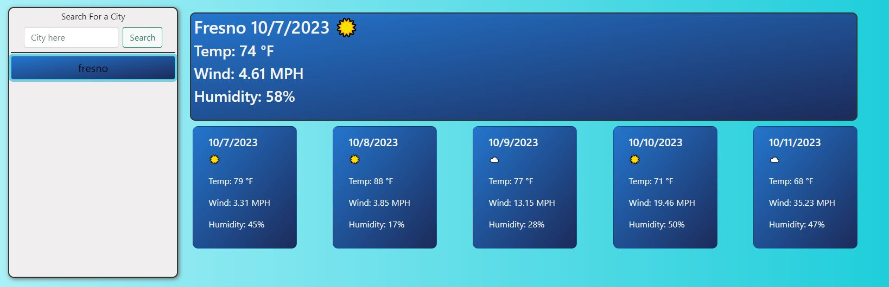

# Weather Dashboard

## Technology Used

| Technology Used |                                                            Resource URL                                                            |
| --------------- | :--------------------------------------------------------------------------------------------------------------------------------: |
| HTML            |               [https://developer.mozilla.org/en-US/docs/Web/HTML](https://developer.mozilla.org/en-US/docs/Web/HTML)               |
| CSS             |                [https://developer.mozilla.org/en-US/docs/Web/CSS](https://developer.mozilla.org/en-US/docs/Web/CSS)                |
| JavaScript      |         [https://developer.mozilla.org/en-US/docs/Web/JavaScript](https://developer.mozilla.org/en-US/docs/Web/JavaScript)         |
| Bootstrap       | [https://getbootstrap.com/docs/5.3/getting-started/introduction/](https://getbootstrap.com/docs/5.3/getting-started/introduction/) |
| Day.js          |                                          [https://day.js.org/en/](https://day.js.org/en/)                                          |
| OpenWeather API |                      [https://openweathermap.org/forecast5#name5](https://openweathermap.org/forecast5#name5)                      |
| Git             |                                            [https://git-scm.com/](https://git-scm.com/)                                            |

## Description

[Visit the Deployed Site](https://jacastro619.github.io/weather-dashboard/)

This is a weather forecast dashboard. Once the user submits a city name into the search box, a weather forecast will populate, displaying the weather for the current day and the next five days for that city. Once a search input has been submitted, a button will appear under the search bar. This is where previous searches will be saved. If at any moment the user would like to see the weather for a previous search, the user may click on the button of a searched city, and the content will display the forecast for that city as if it was typed into the search bar. Based on the time of day where the user is located, the color scheme will be in light mode or dark mode.

## Usage

To use this app, simply type any city into the search bar. Assuming the input is valid, the city's weather forecast will appear to the right of the search bar. Once the input is submitted, a button will appear underneath with the name of the previous city. It will store up to eight previous cities and remove the oldest search after that. Buttons will not be duplicated for cities that are already in the previous search area. If the user wishes to see the forecast for a previously searched city, they can click on the button, and the forecast will be provided.

## Learning Points

In the process of building this weather dashboard app from scratch, I gained valuable experience in web development, harnessing a variety of essential technologies and skills. Starting with HTML and CSS, I structured the app's user interface and styled it accordingly. I also used Bootstrap to ensuring a responsive and visually appealing design. JavaScript played a crucial role in adding interactivity, enabling user input handling, and making server-side API requests to fetch and display weather data. Asynchronous programming techniques and error handling were pivotal in maintaining a smooth user experience. I also delved into local storage for data persistence and learned how to organize and deploy the project effectively. Through debugging and troubleshooting, I also utilized problem-solving skills. Overall, this project provided me with a better understanding of web development, from the front-end to the back-end, setting a strong foundation for future endeavors in application development.

## Author Info

Created by Jorge Castro, a student at UC Berkeley Full Stack Coding Academy. For more information go to https://bootcamp.berkeley.edu/coding/

- [Portfolio](https://jacastro619.github.io/my-portfolio/)

- [LinkedIn](https://www.linkedin.com/in/jorge-castro-2a9545177/)

- [GitHub](https://github.com/Jacastro619)
